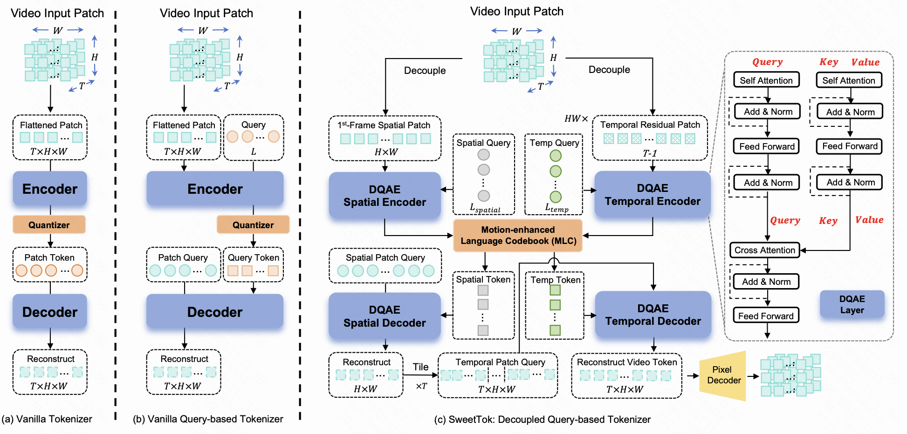

# SweetTok
The official python implementation for ICCV 2025: "[SweetTok: Semantic-Aware Spatial-Temporal Tokenizer for Compact Video
Discretization](https://arxiv.org/pdf/2412.10443?)"

<p align="center">
  
</p>


## Getting started

This project is built with Python 3.10 and PyTorch 2.4.0.

Create your environment with:

```python
conda create -name yourname python=3.10
conda activate yourname

pip install -r requirements.txt
```


## Download model checkpoints and Motion Language Codebook priors

To train SweetTok, you must first download the spatial pretrained model weights, proxy model weights and the MLC codebook prior. All checkpoints can be downloaded from [Google Drive](https://drive.google.com/drive/folders/1QmEfy7qb04As4JJJwMZqkxsZmgBcMRQQ?usp=drive_link). After downloading, organize them according to the directory structure shown below:

```
SweetTok/
├── checkpoints/
│   └── spatial_pretrain.bin
│   └── proxy_model.bin  
├── codebook_priors/
│   └── mlc_codebook_noun_adj.pkl
│   └── mlc_codebook_verb_adv.pkl
└── OmniTokenizer/
    └── fvd/
        └──i3d_pretrained_400.pt
```

## Training

SweetTok adopts a two-stage training pipeline: proxy code training followed by full model training. To train the first stage, use the following:

```python
bash  run_train_stage1.sh
```

When Stage 1 is complete, use its checkpoints to train SweetTok as follows:

```python
bash run_train_stage2.sh
```

Once Stage 1 is finished, use the indices generated by the Stage 1 model to train the generative model as follows:

```python
bash run_train_generator.sh
```

## Testing

To test the reconstruction ability of SweetTok, use the checkpoints trained in Stage 2 with the following command:

```python
bash run_eval.sh
```

To test the generative ability of SweetTok, run the following command:

```python
bash run_eval_gen.sh
```

### Acknowledgement

The code is based on [OmniTokenizer](https://github.com/FoundationVision/OmniTokenizer) and [Titok](https://github.com/bytedance/1d-tokenizer). Thanks for their great work.

### Citation

```
@article{tan2024sweettok,
  title={SweetTok: Semantic-Aware Spatial-Temporal Tokenizer for Compact Video Discretization},
  author={Tan, Zhentao and Xue, Ben and Jia, Jian and Wang, Junhao and Ye, Wencai and Shi, Shaoyun and Sun, Mingjie and Wu, Wenjin and Chen, Quan and Jiang, Peng},
  journal={arXiv preprint arXiv:2412.10443},
  year={2024}
}
```